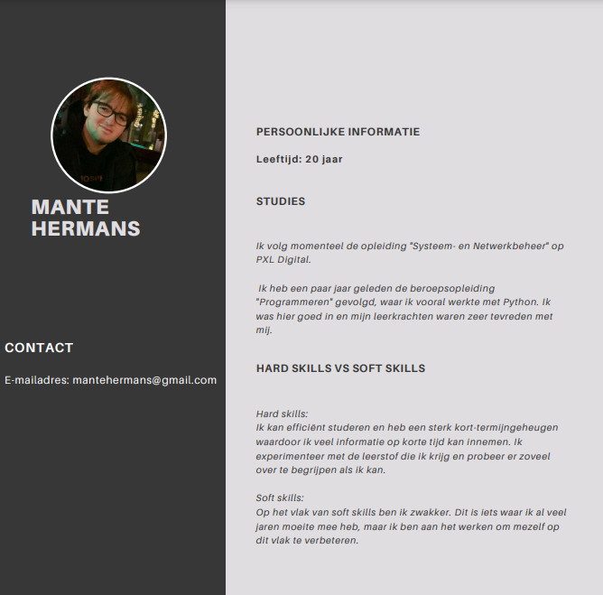

# Inleiding
Dit portfolio dient als een soort documentatie voor de verschillende prestaties, opdrachten, etc die ik over de volledige tijd van mijn ICT-opleiding heb gemaakt en gedaan. Dit portfolio zal om de zoveel maanden geupdatet worden naargelang mijn opleiding doorgaat.
# persoonlijke info
CV: 

Naam: Mante Hermans 
Leeftijd: 20 jaar
E-mailadres: mantehermans@gmail.com
Ik volg momenteel de opleiding "Systeem- en Netwerkbeheer" op PXL Digital. Mijn klas heet 1SNEB. 
Ik heb mijn middelbaar diploma en heb dit behaald door middel van volwassenonderwijs te volgen. Op mijn eerste middelbaar heb ik Latijn gevolgd, vanaf het 2de tot 5de middelbaar heb ik wiskunde/wetenschappen gevolgd. Tegen het einde van het 5de middelbaar ben ik gestopt met school door persoonlijke reden maar heb ik toch mijn diploma behaald in het volwassenonderwijs toen ik 19 was. Ik heb als beroepsopleiding "Programmeren" gevolgd. 

Ik denk dat mijn sterkte's vooral in de hard skills liggen. Ik heb een heel sterk kort-en langtermijngeheugen en ik kan vlot nieuwe leerstof verwerken. Het vak netwerken interesseert mij fel en ik doe dagelijks oefeningen in verband hiermee en doe ook mijn eigen research op bepaalde protocols die ik nog niet volledig begrijp.

Op vlak van soft skills ben ik veel zwakker. In groepswerken ben ik meestal redelijk passief en laat anderen het werk doen. Toch denk ik dat ik veel waarde kan brengen bij een groepstaak als ik mijn soft skills verbeter.

Als werkervaring heb ik als jobstudent in een fabriek gewerkt voor ongeveer een maand. Buiten dit heb ik geen werkervaring. 

Mijn hobby's zijn gamen (vooral osu! en andere rhythm games), ik praat ook veel met vrienden (vooral online) maar ook vaak in het echt in een bar ofzo.

